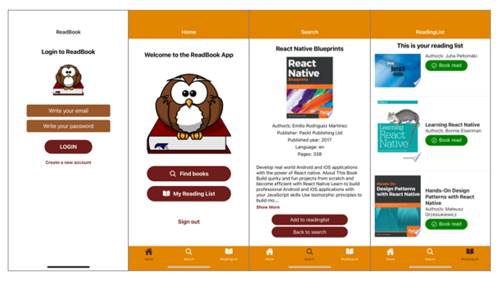

# ReadBook Mobile Application

Language: `ReactNative` and `React`

The project was developed as the final assignment for the Mobile Programming course, which was undertaken as part of my Business Information Technology degree at Haaga-Helia University of Applied Sciences.

## Introduction

### Functionality of the Application:
The project involved developing a mobile application that enables users to create accounts and access book information through the Google Books API interface. In the search view, book covers and brief details are displayed. Users can explore each book in more detail by selecting the 'read more' button, revealing additional information. In this detailed view, the description initially shows the first 300 characters. Pressing `show more` unveils the remaining text, while `show less` allows users to condense the description. Additionally, users have the option to save searched books to their reading list. The project also incorporates Firebase authentication.

### Screens
- **Login Screen:** Authentication
- **Register Screen:** Create new account
- **Home Screen:** Link to find books and my reading list + sign out functionality
- **Search Screen:** Search functionality, fetching data
- **ReadMore Screen:** Showing more information about the books, adding to readinglist function
- **ReadingList Screen:** fetching data from Firebase and displaying saved books
For more information, please refer to the code. Each file contains comments explaining its contents.

### Functionalities Used:
- Google Books API interface
- Nesting navigators: Tab and Stack navigators
- Firebase Authentication: sign in and registratin
- Firebase Realtime Database
- MUI library
- IonIcons, expo-constants, ListItem
- Splash picture

## User Interface

## Google Books API
The application utilizes the `Google Books API`. The ReadBook app employs a straightforward search feature. You can learn more about the API's functionality on Google's official page: [https://developers.google.com/books/docs/overview](https://developers.google.com/books/docs/overview)

## Database
The used database is Firebase, utilized for both authentication and saving book information.
Currently, the information saved in the Realtime Database includes the book's title, authors, and the URL where the image is located.
Data can be accessed using calls like item.title, item.image, or item.authors.
The information cannot currently be saved individually on a user-specific basis.

## Firebase authentication
This application uses the Firebase authentication function for signing in and creating a new account. 
You can read more about this, on [Firebase website](https://firebase.google.com/docs/auth?authuser=0)

Used Firebase version is 10.5.2.

## Login and signing up
The app features login and registration screens, and the functionality allows users to successfully create a new account, which is stored in the Firebase authentication page. While the login functionality appears to work, there are issues transitioning the user from the login screen to the home screen. This is why the App.js document currently displays the homepage instead of the login option.

## Testing
Testing primarily involved end-to-end testing, and the key functionalities performed as expected. However, a few deficiencies were identified during testing that could be further improved:
* In the Search view, only the results from the first page of the Google Books API are displayed. Enhancements could be made to show more books.
* On iPhone devices, a notable issue was that the keyboard occasionally covered the page content disruptively.
* The placeholder image did not consistently display correctly in all situations. While the functionality itself works as intended, sometimes, instead of the placeholder image, the image from the previous search appeared based on consecutive searches. This occurs only when the book does not have its own image, and consecutive searches have been performed.
* Error handling is partly missing, and attention should be given to enhancing it throughout the application.
* Book data cannot be saved on a user-specific basis.
* Currently Login and Signup functions are not in use. Nestling navigation causes some problems changing the screens after successfull login.

## Instalation information
First, ensure you have a programming environment installed. I recommend using [Visual Studio Code](https://code.visualstudio.com/). Next, clone the ReadBook repository to your desired location by navigating to that location in your terminal and using the command `git clone https://github.com/UllaMontonen/BookApp_ReactNative.git`.

If you wish to test the app on your mobile device, install Expo Go from the App Store or Google Play. Alternatively, you can use an emulator. If you're using a Mac, you'll also need to install Watchman.

Create a Firebase account, and set up a new project with a real-time database and authentication. Create a `.env` file where you can paste your Firebase config information. Refer to the React Native documentation for guidance on creating .env files.

Please consult the documentation for [ReactNative](https://reactnative.dev) and [Expo](https://docs.expo.dev/get-started/installation/)

To run the project, open it in your programming environment and use the command `npm start` in your code terminal. After running this command, you will see a QR code in your terminal. Scan it with your phone, and the Expo Go app will start, running the ReadBook app.